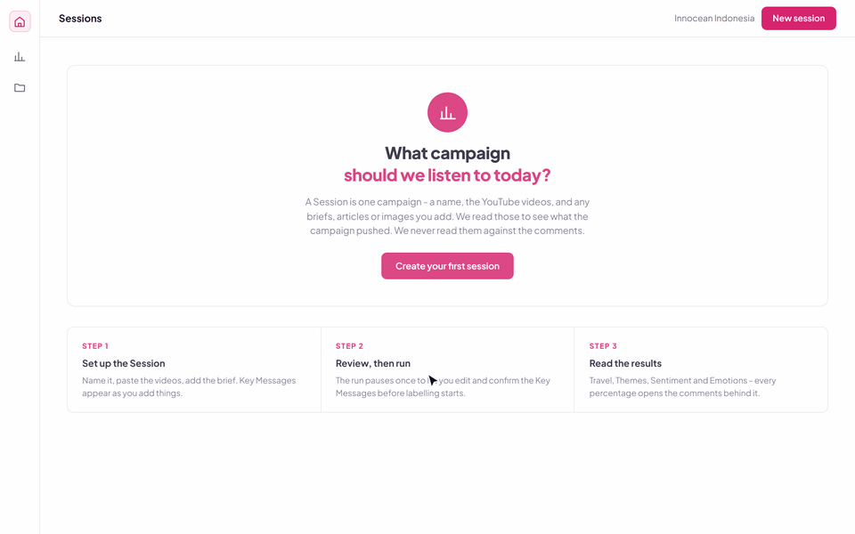
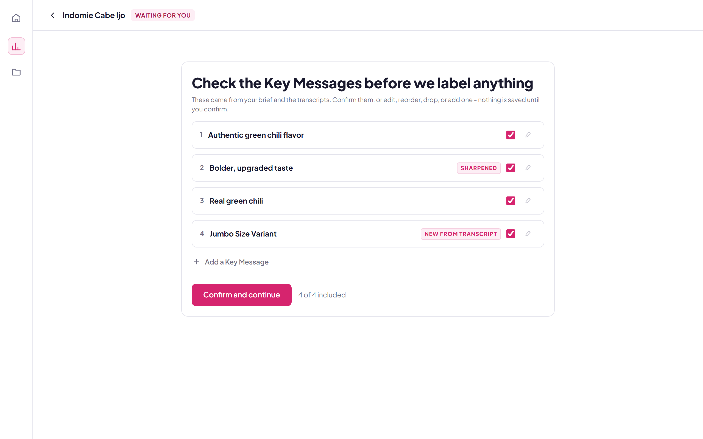
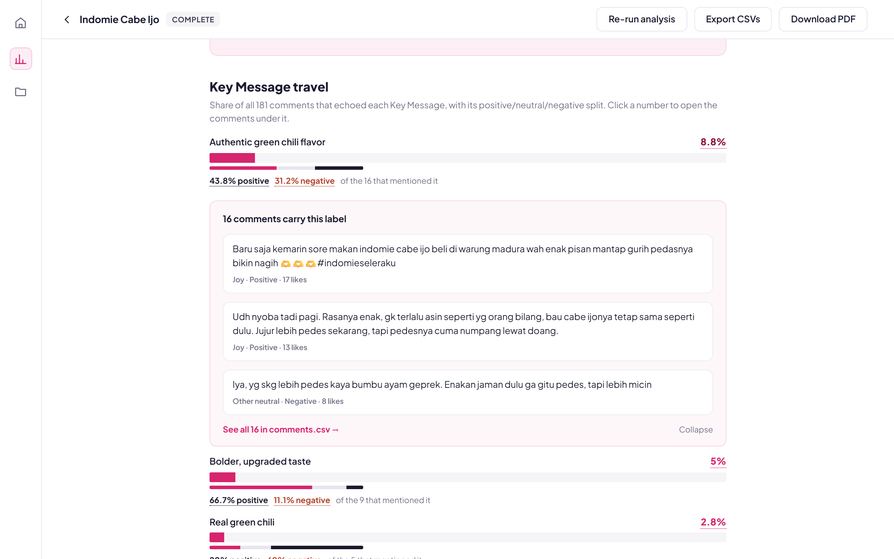
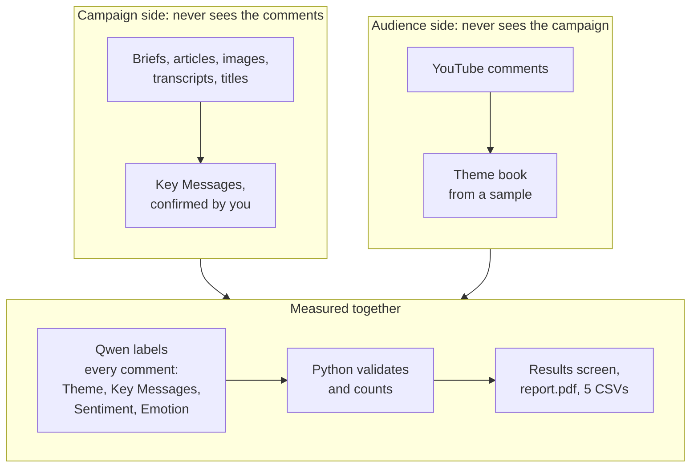
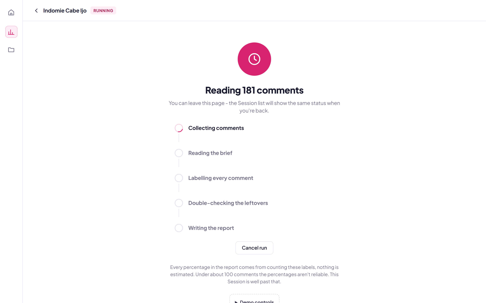
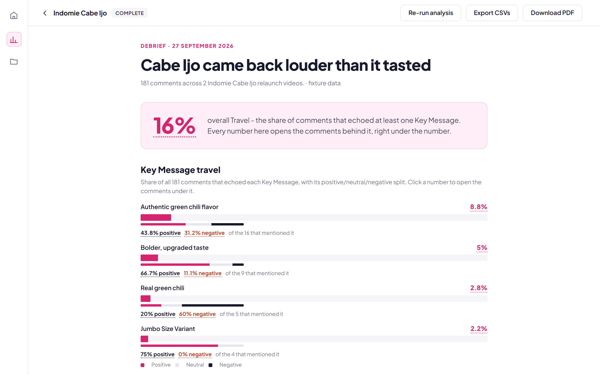

# Kowalski, analysis but YouTube

Reads a campaign's YouTube comments and reports whether the message landed. UI/UX is inspired from [GWI](https://www.gwi.com/) for InnOcean's familiarity with the tool already.

[Live demo](https://aubreyasta.github.io/Kowalski-Analysis-for-YouTube/?demo=1#/runs/example-run/results) · [Sample report (PDF)](app/demo/report.pdf) · [Setup](docs/setup.md) · [Architecture](docs/architecture.md)



Kowalski takes a campaign's YouTube videos and briefs and returns a reception report: which Key Messages the audience repeated, what else they talked about, and how they felt. It was built at Innocean Indonesia for the agency's campaign strategists.

---

## Why it works this way

The tool answers two questions separately and then joins them:

1. **What did the campaign push?** Read from the campaign's own material: video transcripts, titles, descriptions, and the briefs, articles, and images you upload. Never from the comments.
2. **What did the audience talk about?** Read from the comments. Never from the campaign material.

Keeping them apart is the point. If the model saw the comments while describing the campaign, "did the message land" becomes circular and always answers yes.

A Key Message with a low Travel score **did not arrive**, which is a different diagnosis from being rejected. The fix for the first is execution and media. The fix for the second is the idea.

---

## Highlights

- **Key Messages drafted live.** Add a PDF, DOCX, or PPTX brief, an article URL, or a campaign image, and the Key Messages update on the page before any run starts.
- **A human checks the Key Messages before labelling.** The run pauses after reading the transcripts. You edit, drop, or add Key Messages, then confirm. Nothing is measured against a Key Message you did not approve.
- **One model pass per comment.** A local Qwen model gives every comment one Theme, zero or more Key Messages, one Sentiment, and one Emotion.
- **Every number opens its comments.** Python counts every percentage from per-comment labels. Click any figure to read the comments behind it.
- **Six exports.** A PDF debrief and five CSVs shaped for Google Slides or any chart tool.
- **No external model API.** The model runs in LM Studio on machines you control, so client material stays in-house and a run has no per-token cost.
- **Office sign-in.** Google Workspace accounts only. Admins can block or erase users.





---

## How it works



Percentages are counted in Python over per-comment labels. The model never produces a statistic directly. Models are poor at counting over large sets, and a number with no per-comment label behind it cannot be checked. Every figure in the report traces back to rows in `comments.csv`.

Evidence works the same way. For each metric the tool takes up to eight comments that carry that label, ranked by likes and then by length. It is a rule, not a selection, so nobody picks quotes to fit a story.

---

## Tech stack

| Layer | Tools |
|---|---|
| Model | `Qwen3.8-27B` (multimodal) served by LM Studio |
| Pipeline | Python, pandas, YouTube Data API, `youtube-transcript-api`, `langdetect` |
| Backend | FastAPI, Uvicorn, SQLite, server-sent events for run progress |
| Frontend | Vanilla JavaScript and CSS, no framework, no build step |
| Documents | `pypdf`, `python-docx`, `python-pptx` for inputs; Playwright Chromium for `report.pdf` |
| Auth | Google Workspace OAuth |

---

## Try it

**[Live demo](https://aubreyasta.github.io/Kowalski-Analysis-for-YouTube/?demo=1#/runs/example-run/results), no model or keys needed.** The frontend has a demo mode that replays the hand-labelled Indomie Cabe Ijo Session from `app/demo/`. It never calls the model or the API. It opens on the finished Session's results. Create a new Session, paste any YouTube link, and start a run to walk the full flow, including the Key Message review, in under a minute.

The same demo runs locally:

```bash
python -m http.server 8000 --bind 127.0.0.1 --directory app
# open http://127.0.0.1:8000/?demo=1
```

**Full app.** Needs YouTube API keys, a Google OAuth client, and LM Studio.

```bash
pip install -r requirements.txt -r requirements-server.txt
playwright install chromium
python server.py
# http://localhost:8000
```

Installation, model setup, and troubleshooting: [docs/setup.md](docs/setup.md). Deployment state: [docs/deployment.md](docs/deployment.md).

There is also a CLI (`python run.py`, configured through `config.py`) for debugging the pipeline without the web layer. It is not the product and it is not maintained to the same standard.

---

## Terms

These are the only words used in this repo's prose. Code identifiers still carry older names in places.

| Term | Means |
|---|---|
| Session | One campaign under analysis. Name, videos, and User Inputs. One session, one campaign. |
| Videos | The YouTube videos you add to a Session. |
| User Inputs | Briefs, articles, and images you upload so the tool knows what the campaign was trying to do. |
| Key Messages | What the campaign pushes. Drafted from your User Inputs as you add them, updated with the video transcripts when the run starts, then reviewed by you before labelling. |
| Theme book | The list of Themes the LLM discovers from a sample of the comments. |
| Themes | What the comments talk about. One Theme per comment. |
| Sentiment | Positive, neutral, negative. |
| Emotions | Joy, anger, sadness, fear, or other/neutral. |
| Travel | The share of comments that mention a given Key Message. |

---

## The flow

**Set up a Session.** Give it a name and paste YouTube links. Add User Inputs: PDF, DOCX, or PPTX briefs, article URLs, campaign images. Each one is read as you add it, and the Key Messages appear on the page straight away, so you can see whether the tool understood the campaign before committing to a run.

**Review the Key Messages.** The run pauses after collecting the transcripts, which can sharpen or add to the draft. Edit the wording, exclude the ones that are wrong, confirm. If another analysis is waiting, a review left alone for 10 minutes stops the run so it does not hold that analysis up.

**Run.** In order: scrape comments and transcripts, build the Theme book from a sample, then label every comment in one Qwen classification pass. Python validates the labels and counts the results.



**Read the results.** Key Message Travel as percentages with a positive and negative split, the Theme mix, overall Sentiment, overall Emotions, and a written summary. Opening a completed Session from the list goes straight to its results. "Re-run analysis" returns to the setup page.



---

## What you get

Six files per run.

| File | For |
|---|---|
| `report.pdf` | The debrief. Same content as the results screen. An internal debrief, not a client deliverable. |
| `comments.csv` | Every cleaned comment with its Theme, Key Messages, Sentiment, Emotion, likes, and language. This is the file for handpicking quotes. |
| `key-messages.csv` | Travel percentages per Key Message. |
| `themes.csv` | Theme frequencies. |
| `sentiment.csv` | Sentiment breakdown. |
| `emotions.csv` | Emotion breakdown. |

Downloads are named `<Session>-<YYYY-MM-DD HHmm>-<File>`, stamped with the run's finish time in local time, for example `Spring Launch-2026-09-19 1430-Key Messages.csv`.

The four small CSVs drop straight into Google Slides or any chart tool. The pipeline draws no charts of its own on purpose, because the design team builds their own.

---

## The model

The tool runs a multimodal `Qwen3.8-27B` build through LM Studio (API key `qwen/qwen3.8-27b`). The model drafts grounded Key Messages from User Inputs and labels every comment. Python validates every label and counts every percentage.

The server reaches LM Studio on the same machine or on a private-network host through `LLM_BASE_URL`, with an optional API token in `LLM_HEADERS`. Throughput depends on the model build, context, batch size, and corpus. With `CLASSIFY_BATCH_SIZE=16`, a 574-comment run finished in 32 minutes.

---

## Limits

- Sentiment and Emotion labels are assigned per comment with no surrounding context. Sarcasm and measured criticism both read as anger. The Theme mix is the better answer to "how was this received". Emotion is the answer to "the client asked for sentiment".
- A video with no captions falls back to its title and description, flagged in the report.
- Under about 100 comments the percentages are not reliable. The report says so per Session.
- Commenters are not buyers. This is directional qualitative input, not market research.

---

## Status

Finished on 2026-09-11. Two real Sessions ran through the web app against the live model, and each labelled all 574 comments. Known bugs and planned work are [open GitHub issues](https://github.com/aubreyasta/Kowalski-Analysis-for-YouTube/issues).

Chat, source discovery, OCR, custom lenses, and run history are out of scope. Disabled controls stay disabled rather than pretending those features exist.

---

## Docs

- [docs/setup.md](docs/setup.md) install, configure, run, troubleshoot.
- [docs/deployment.md](docs/deployment.md) current deployment state and the reference Mac procedure.
- [docs/architecture.md](docs/architecture.md) how the pipeline, backend, and frontend fit together.
- [docs/api-reference.md](docs/api-reference.md) the HTTP contract.

The README screenshots and walkthrough GIF come from the demo mode. Regenerate them with `python demo_data/capture_screenshots.py` (needs `ffmpeg` on `PATH`).

---

## Credits

Built by Samudera Aubreyasta at Innocean Indonesia, with deployment support from James Purnama.

## License

© 2026 Samudera Aubreyasta. All rights reserved.
